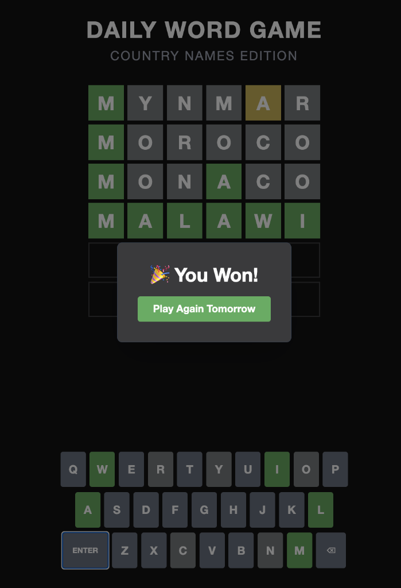

# Daily Word Game

A full-stack, AI-powered daily word game (Wordle clone) that generates unique game modes using Google's Gemini AI.



## Features

-   **AI-Generated Content**: Uses Google Gemini 2.5 Flash to generate word lists based on any topic you choose (e.g., "Space", "Fruits", "80s Movies").
-   **Variable Word Lengths**: Supports word lengths from 5 to 10 characters, or mixed lengths within a game mode.
-   **Daily Rotation**: Automatically selects a new word each day based on the generated list.
-   **Full Stack**: Built with FastAPI (Python) backend and React (Vite) frontend.
-   **Deploy Ready**: Includes Dockerfile and scripts for easy deployment to Google Cloud Run.

## Prerequisites

-   Python 3.11+
-   Node.js & npm
-   Google Cloud SDK (for deployment)
-   Gemini API Key (Get one from [Google AI Studio](https://aistudio.google.com/))

## Local Setup

1.  **Clone the repository** (if applicable) and navigate to the project folder:
    ```bash
    cd daily_word_game
    ```

2.  **Create a `.env` file**:
    Create a file named `.env` in the root directory and add your API key:
    ```env
    GEMINI_API_KEY=your_actual_api_key_here
    ```

3.  **Set up the Python environment**:
    ```bash
    python3 -m venv .venv
    source .venv/bin/activate  # On Windows: .venv\Scripts\activate
    pip install -r requirements.txt
    ```

4.  **Initialize the Game**:
    Run the setup script to generate your custom game database.
    ```bash
    python setup_game.py
    ```
    Follow the prompts to choose a topic (e.g., "Country Names") and max word length.

5.  **Build the Frontend**:
    ```bash
    cd frontend
    npm install
    npm run build
    cd ..
    ```

6.  **Run the Server**:
    ```bash
    uvicorn backend.main:app --reload
    ```
    Open [http://localhost:8000](http://localhost:8000) in your browser to play!

## Deployment (Google Cloud Run)

This project is ready to be deployed to Google Cloud Run as a containerized application.

1.  **Authenticate with Google Cloud**:
    ```bash
    gcloud auth login
    gcloud config set project YOUR_PROJECT_ID
    ```

2.  **Run the Deployment Script**:
    ```bash
    chmod +x deploy.sh
    ./deploy.sh
    ```
    Follow the prompts to build and deploy the image.

## Resetting the Game

To start a fresh game with a new topic:
1.  Run `python setup_game.py` again.
2.  It will detect the existing database and ask if you want to delete it and start over.
3.  Confirm 'y' and enter your new topic and settings.

## Project Structure

-   `setup_game.py`: CLI tool to generate the game database using AI.
-   `backend/`: FastAPI application and SQLite database.
-   `frontend/`: React application (Vite + Tailwind CSS).
-   `Dockerfile`: Multi-stage build for production.
